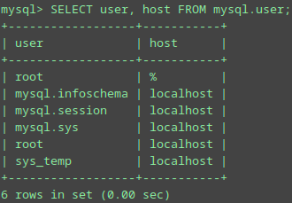
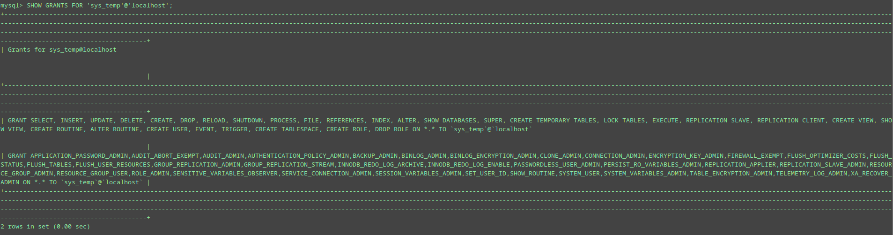
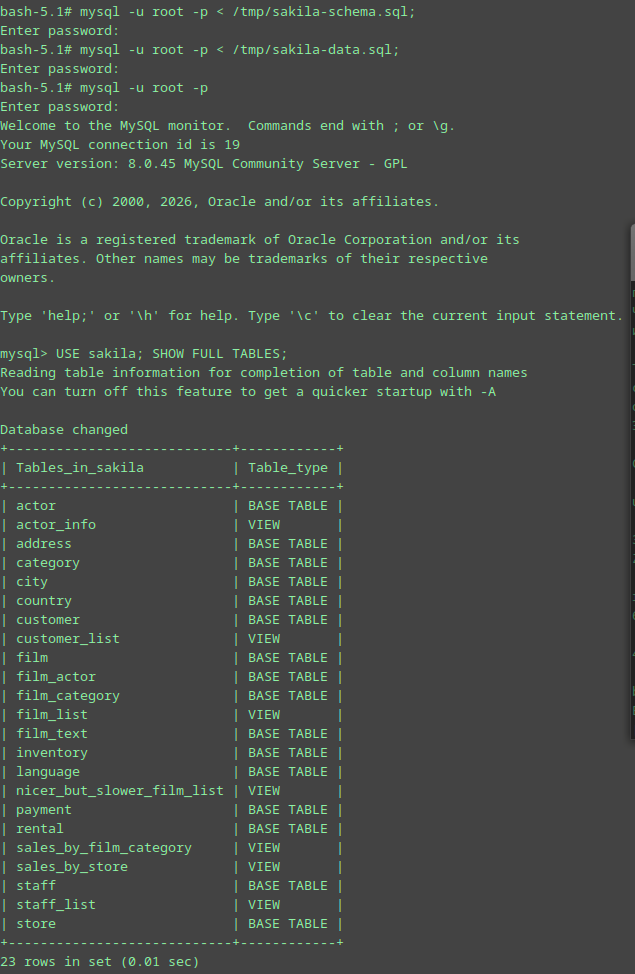
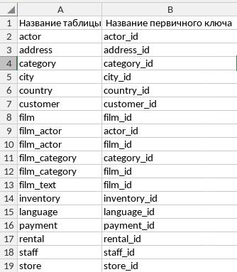

# Домашнее задание к занятию "`Работа с данными (DDL/DML)`" - `Шмагин Максим`


### Задание 1

```
1.1. Поднимите чистый инстанс MySQL версии 8.0+. Можно использовать локальный сервер или контейнер Docker.

1.2. Создайте учётную запись sys_temp.

1.3. Выполните запрос на получение списка пользователей в базе данных. (скриншот)

1.4. Дайте все права для пользователя sys_temp.

1.5. Выполните запрос на получение списка прав для пользователя sys_temp. (скриншот)

1.6. Переподключитесь к базе данных от имени sys_temp.

Для смены типа аутентификации с sha2 используйте запрос:

ALTER USER 'sys_test'@'localhost' IDENTIFIED WITH mysql_native_password BY 'password';
1.6. По ссылке https://downloads.mysql.com/docs/sakila-db.zip скачайте дамп базы данных.

1.7. Восстановите дамп в базу данных.

1.8. При работе в IDE сформируйте ER-диаграмму получившейся базы данных. При работе в командной строке используйте команду для получения всех таблиц базы данных. (скриншот)

Результатом работы должны быть скриншоты обозначенных заданий, а также простыня со всеми запросами.

```

Ответ:

`1.3. Выполните запрос на получение списка пользователей в базе данных. (скриншот)`



`1.5. Выполните запрос на получение списка прав для пользователя sys_temp. (скриншот)`



`1.8. При работе в IDE сформируйте ER-диаграмму получившейся базы данных. При работе в командной строке используйте команду для получения всех таблиц базы данных. (скриншот)`



`Простыня со всеми запросами`

```
docker run --name mysql-homework -p 3306:3306 -e MYSQL_ROOT_PASSWORD=rootpass -d mysql:8.0

docker exec -it mysql-homework mysql -u root -p

CREATE USER 'sys_temp'@'localhost' IDENTIFIED BY 'temppass';

SELECT user, host FROM mysql.user;

GRANT ALL PRIVILEGES ON *.* TO 'sys_temp'@'localhost';

FLUSH PRIVILEGES;

SHOW GRANTS FOR 'sys_temp'@'localhost'

ALTER USER 'sys_temp'@'localhost' IDENTIFIED WITH mysql_native_password BY 'temppass';

FLUSH PRIVILEGES;

docker cp sakila-data.sql  mysql-homework:/tmp

docker cp sakila.mwb  mysql-homework:/tmp

docker cp sakila-schema.sql  mysql-homework:/tmp

docker exec -it mysql-homework mysql -u sys_temp -p  < /tmp/sakila-schema.sql

docker exec -it mysql-homework mysql -u sys_temp -p  < /tmp/sakila-data.sql

docker exec -it mysql-homework mysql -u sys_temp -p

USE sakila; SHOW FULL TABLES;
```


### Задание 2

```
Составьте таблицу, используя любой текстовый редактор или Excel, в которой должно быть два столбца: в первом должны быть названия таблиц восстановленной базы, во втором названия первичных ключей этих таблиц. Пример: (скриншот/текст)

Название таблицы | Название первичного ключа
customer         | customer_id
```
Ответ:

